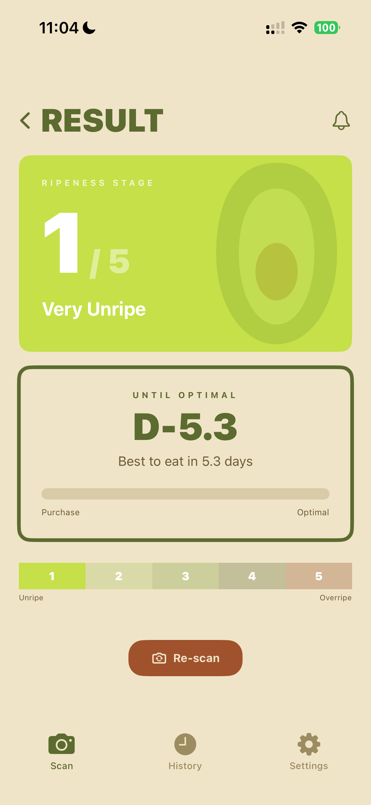
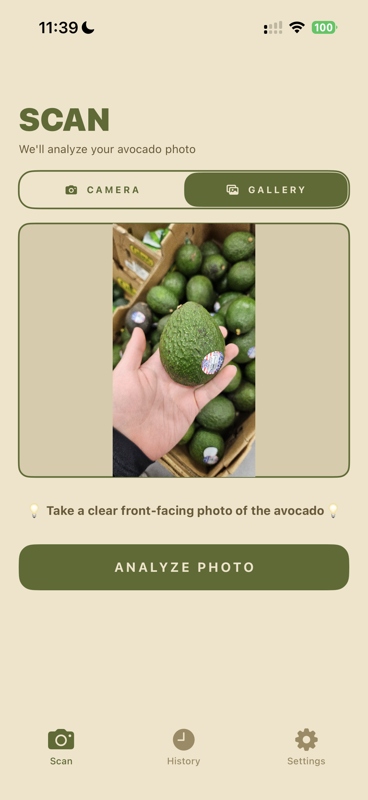
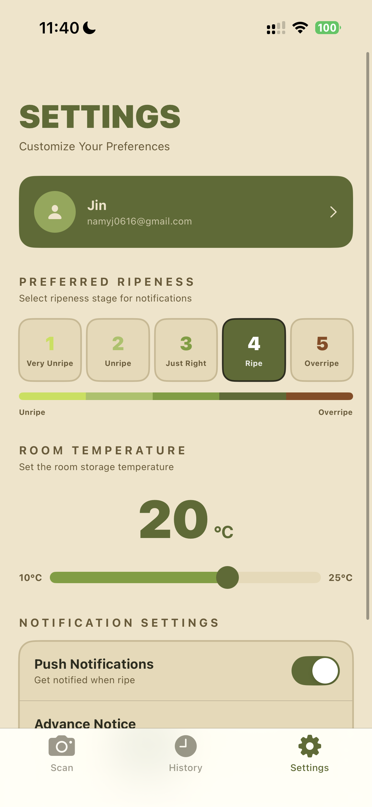

# 🥑 D-avocado

> **AI-powered avocado ripeness tracking platform**

Snap a photo of an avocado, find out its ripening stage, and know exactly how many days are left until it's ready to eat.

D-avocado classifies avocado ripeness (Stages 1–5) from a single photo using a deep learning model (ResNet-18), then predicts the remaining days until your preferred eating stage (D-day), adjusted for storage temperature.

---

# 📱 Service Introduction

D-avocado is an AI-powered mobile application that helps users determine the optimal time to eat an avocado.

Instead of relying on subjective judgment, users simply take a photo of an avocado. The system automatically classifies its ripeness into one of five stages and predicts how many days remain until it reaches the user's preferred ripeness.

To improve the overall user experience, the application stores scan history, supports personalized ripeness preferences, and provides notifications before the avocado reaches its optimal eating stage.

<p align="center">
  
  
  
</p>

---

# 🎥 Live Demo

<p align="center">
  <a href="https://youtu.be/Uzf3WhIbDaI">
    
  </a>
</p>

<p align="center">
  <b>▶️ Watch the D-avocado Demo</b>
</p>

---

# ✨ Features

- 📷 **Ripeness Classification**
  - Upload a photo and receive a five-stage ripeness prediction with confidence scores.

- 📅 **D-day Prediction**
  - Estimate the remaining days until the avocado reaches your preferred ripeness stage.

- 🌡 **Temperature-aware Prediction**
  - D-day is adjusted using storage temperature.

- 👤 **Personalized Preferences**
  - Save your preferred eating stage once and apply it automatically to every scan.

- 🔔 **Notifications**
  - Receive reminders before the avocado reaches its target ripeness.

- 📚 **History**
  - Browse previous scans and prediction results.

---

# 🛠 Tech Stack

| Layer | Stack |
| --- | --- |
| Mobile (iOS) | Swift / Xcode |
| Backend API | Spring Boot 3.4.2, Java 21 |
| ML Inference | FastAPI, PyTorch (ResNet-18) |
| Database | PostgreSQL (Cloud SQL) |
| Image Storage | Google Cloud Storage |
| Infrastructure | Cloud Run, Artifact Registry, Vertex AI Custom Job |

---

# 🏗 Architecture

<p align="center">

</p>

```
                 ┌───────────────┐
                 │   iOS App     │
                 └───────┬───────┘
                         │ HTTPS
                 ┌───────▼────────────┐
                 │ Spring Boot API    │
                 │ (Cloud Run)        │
                 │  - Authentication  │
                 │  - Scan Management │
                 │  - Notifications   │
                 └───┬───────────┬────┘
                     │           │
        ┌────────────▼──┐   ┌────▼─────────────┐
        │ Cloud SQL      │   │ Cloud Storage    │
        │ PostgreSQL     │   │ Images           │
        └────────────────┘   └──────────────────┘
                     │
              ┌──────▼────────────────┐
              │ FastAPI AI Service    │
              │ (Cloud Run)           │
              │ - Image Preprocessing │
              │ - ResNet-18           │
              │ - AutoML              │
              │ - D-day Prediction    │
              └───────────────────────┘
```

The backend manages authentication, user information, scan history, and cloud storage.

The AI inference service is fully independent and performs image preprocessing, ripeness prediction, and D-day estimation.

---

# 🚀 End-to-End Workflow

```
Take Photo
      │
      ▼
Upload Image
      │
      ▼
Spring Boot API
      │
      ▼
Image Preprocessing
      │
      ▼
AI Inference
      │
      ▼
Ripeness Prediction
      │
      ▼
D-day Calculation
      │
      ▼
Save History
      │
      ▼
Return Result
```

---

# 📂 Repository Structure

```
d-avocado/
│
├── docs/
│   ├── PRD.md
│   ├── API_spec.md
│   ├── DB_spec.md
│   ├── Architecture.md
│   └── images/
│
├── davocado-frontend/
├── davocado-backend/
└── d-avocado-ripeness-mlops/
```

---

# 📚 Documentation

| Document | Description |
|----------|-------------|
| [PRD](https://github.com/QI-26SUMMER/d-avocado/blob/main/docs/PRD.md) | Product requirements |
| [API Specification](https://github.com/QI-26SUMMER/d-avocado/blob/main/docs/API.md) | Backend API documentation |
| [Database Specification](https://github.com/QI-26SUMMER/d-avocado/blob/main/docs/Database.md) | Database schema |
| [System Architecture](https://github.com/QI-26SUMMER/d-avocado/blob/main/docs/Architecture.md) | Overall system architecture |
| [Deployment](https://github.com/QI-26SUMMER/d-avocado/blob/main/docs/Deployment.md) | Deployment and infrastructure |
| [AI Documentation](https://github.com/QI-26SUMMER/d-avocado/blob/main/docs/AI.md) | AI model, training, and evaluation |

---

# 📖 Dataset & References

### Dataset

- Hass Avocado Ripening Photographic Dataset (~14,700 images)

### References

- Xavier et al. (2024), *Foods*
- Perez et al. (2004)
- Arpaia et al. (2018)

---

# 👥 Team

## Team Photo

<p align="center">

</p>

## Members

<table>
<tr>

<td align="center">
<br>
<b>Member 1</b><br>
</td>

<td align="center">
<br>
<b>Member 2</b><br>
</td>

<td align="center">
<br>
<b>Member 3</b><br>
</td>

<td align="center">
<br>
<b>Member 4</b><br>

<td align="center">
<br>
<b>Member 5</b><br>
</td>

</tr>
</table>

## Responsibilities

| Member | Major |
|---------|------------------|
| Taeyeon Hwang | Kyonggi University Computer Science |
| Yujin Nam | Keimyung University Computer Science |
| HyeongJun Kim | Chosun University Information and Communication Engineering |
| Seungchae Lee | Kumoh National Institute Of Tech |
| Seon Ung | Keimyung University Automotive Engineering |

---

# 📌 Future Work

- Push notification scheduling
- Continuous model retraining
- Explainable AI
- Model monitoring
- CI/CD automation
- Performance optimization

---

# 📄 License

This project was developed as a university capstone project for educational and research purposes.
